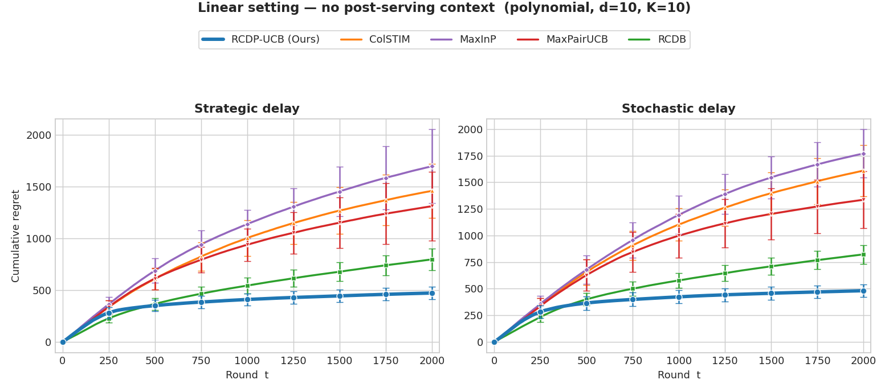
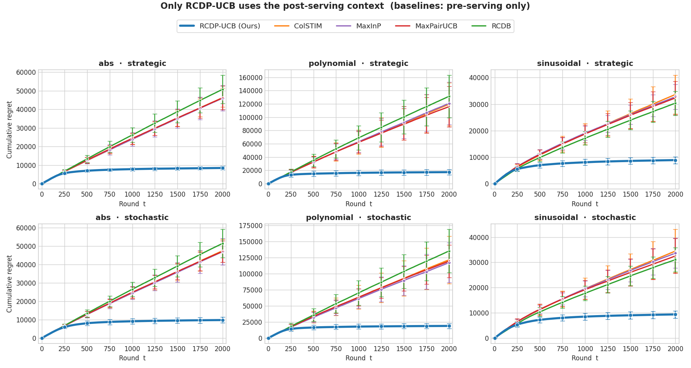
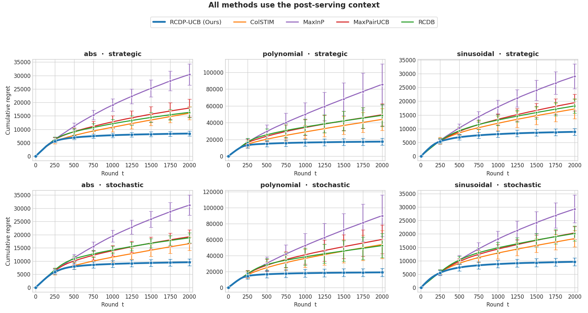

# RCDP-UCB — Robust Linear Dueling Bandits with Post-serving Context under Unknown Delays and Adversarial Corruptions

<p align="center">
  <a href="https://arxiv.org/abs/2605.01752"></a>
  
  
  
</p>

Official reference implementation of the **ICML 2026** (Poster) paper by Youngmin Oh · [arXiv:2605.01752](https://arxiv.org/abs/2605.01752).

**RCDP-UCB** (Robust to **C**orruption, **D**elay, and **P**ost-serving) is the first contextual
dueling-bandit algorithm that simultaneously handles three obstacles that arise together in
real preference-based systems (e.g. RLHF, recommendation, ride-hailing):

1. **Post-serving context** — features revealed only *after* an action is served (delivery time, food temperature, …), which the learner must predict from pre-serving context.
2. **Unknown feedback delays** — stochastic *or* adversarial, with the regime hidden from the learner.
3. **Adversarial corruption** — a budget-limited adversary that flips preference outcomes.

The algorithm pairs a learned post-serving predictor with an **adaptive, uncertainty-aware
re-weighting** of observations, and provably achieves

$$R_T = \widetilde{\mathcal{O}}\big(d(\sqrt{T} + \mathcal{C} + \mathcal{D})\big), \qquad \mathcal{D} = \max(\sqrt{\Lambda},\, \mu_\tau),$$

which matches the lower bound up to a $\sqrt{d}$ factor in the adversarial-delay regime — and is
**agnostic to the delay regime** (no need to know whether delays are stochastic or adversarial).

---

## ✨ Highlights

- **One unified mechanism** for corruption *and* delay: clip / down-weight observations whose
  complete feature vector has high statistical leverage on the full-information geometry $\overline{V}_t$.
- **Delay-regime-agnostic**: the weights are anchored to the *full* sequence of contexts (revealed
  instantly), decoupling parameter estimation from the realized delay schedule.
- **Strong empirics**: across a broad range of synthetic settings (varying mappings, dimensions,
  arm counts, and corruption/delay budgets), RCDP-UCB **consistently achieves the lowest regret**,
  with empirically sub-$\sqrt T$ growth.

---

## 📊 Results at a glance

Across the synthetic experiments, **RCDP-UCB consistently achieves the lowest cumulative regret**.
Error bars show ±1 std over 10 runs; every panel is plotted from `results/<experiment>/`. Regenerate
all three figures below in one command with **`python main.py figures`**.

**1 · Linear setting — no post-serving context** *(paper Fig. 1)*

<p align="center">
  
</p>

**2 · Only RCDP-UCB uses the post-serving context** — baselines see pre-serving features only *(paper Fig. 3)*

<p align="center">
  
</p>

**3 · All methods use the post-serving context** — a level playing field, and RCDP-UCB still leads *(paper Fig. 2)*

<p align="center">
  
</p>

---

## 🚀 Quickstart

```bash
pip install -r requirements.txt          # numpy, torch, matplotlib, pandas (no GPU needed)

python main.py list                      # see every experiment
python main.py run post-serving --phi abs --delay strategic --n_runs 10  # one quick config
```

Everything runs through a **single entry point, `main.py`**, with three commands:

```bash
python main.py list                                  # list experiments + which paper figure they map to
python main.py run  <experiment> [options]           # run a single configuration
python main.py reproduce <experiment> [--n_runs 10]  # run that experiment's full paper sweep
python main.py reproduce --all                        # reproduce everything
python main.py figures                                # regenerate the README figures into assets/
```

| Experiment | Paper | What it shows |
|------------|-------|---------------|
| `linear`         | Fig. 1 | linear dueling, **no** post-serving context |
| `post-serving`   | Fig. 2 | all methods learn the post-serving mapping |
| `representative` | Fig. 3 | **only** RCDP-UCB exploits post-serving context |
| `std-ablation`   | Appendix | RCDP-UCB vs. stochastic-delay variance |

Common `run` options (see `python main.py run -h`): `--phi {polynomial,abs,sinusoidal,…}`,
`--d`, `--K`, `--delay {stochastic,strategic}`, `--mean`, `--std`, `--delay_mag`,
`--corruption_budget`, `--T`, `--n_runs`. Outputs (regret plot + tidy CSV) are written to
`results/<experiment>/`.

---

## 📦 Repository layout

| File | Description |
|------|-------------|
| `main.py` | **Single entry point** — `list` / `run` / `reproduce`. |
| `experiments.py` | Declarative experiment **registry** + the one unified driver (env + learner construction, seeding, plotting, CSV). |
| `contextual_dueling_bandit.py` | Core library: environment, **RCDP-UCB**, all baselines, delay/corruption models, and the `run_simulation` driver. |
| `requirements.txt` | Python dependencies (CPU-only is fine). |

`run_simulation(env, learner, T, name=...)` runs one learner for `T` rounds and returns its
cumulative-regret trajectory; every learner implements the same `select_arms / observe_context /
update` interface. To add an experiment, register one entry in `experiments.py` — no new script.

## 🧠 Algorithm & baselines

| Display name | Class | Source |
|--------------|-------|--------|
| **RCDP-UCB (Ours)** | `DuelingGLMLearner` | this work |
| RCDB | `RCDBLearner` | Di et al., 2025 |
| ColSTIM | `ColSTIMLearner` | Bengs et al., 2022 |
| MaxInP | `MaxInPLearner` | Saha, 2021 |
| MaxPairUCB | `MaxPairUCBLearner` | Di et al., 2024 |

For the `post-serving` experiments, each baseline is augmented with the same neural
post-serving predictor (the `…PostServingLearner` variants) so the comparison isolates the
weighting/selection strategy. Pre→post-serving mappings include `sinusoidal`, `polynomial`,
`abs`, `cosine`, `piecewise`, `linear`, and `interaction`.

---

## 📈 Empirical behavior

- **RCDP-UCB consistently attains the lowest cumulative regret** across the synthetic settings, with
  regret growing noticeably slower than the strongest baseline.
- Regret grows mildly with dimension `d`, arm count `K`, and corruption budget `C`, and stays
  **nearly flat as the adversarial delay budget increases** — the delay-robustness the theory predicts.

Each run writes a regret plot (`.pdf`) and the raw per-run curves (`.csv`) to
`results/<experiment>/`; filenames encode the full setting.

---

## 📝 Citation

```bibtex
@inproceedings{oh2026robust,
  title     = {Robust Linear Dueling Bandits with Post-serving Context under
               Unknown Delays and Adversarial Corruptions},
  author    = {Oh, Youngmin},
  booktitle = {Proceedings of the 43rd International Conference on Machine Learning},
  series    = {Proceedings of Machine Learning Research},
  publisher = {PMLR},
  year      = {2026},
  note      = {To appear. arXiv:2605.01752}
}
```

> Once the official PMLR proceedings are published, add the final `volume`, `pages`, and `editor`.

## 📄 License

Released under the MIT License — see [`LICENSE`](LICENSE).

---

<p align="center">
  ⭐ <b>If this code or paper is useful to your research, please consider starring the repo and citing the paper.</b> ⭐
</p>
